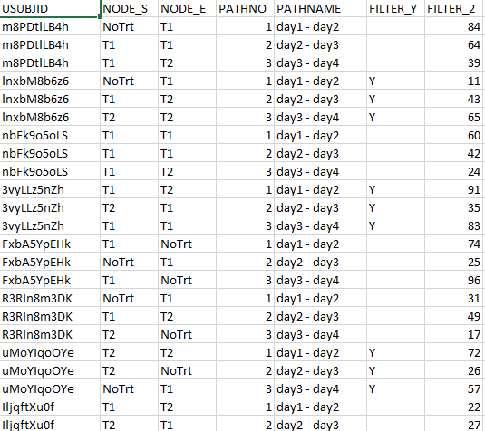

# Sankey App

  
  

  ## Introduction

  This app was developed to visualise treatment patterns in clinical trials. Later it was developed further to now host any kind of data that contain flow patterns that
  can be visualised with Sankey Diagrams.
    
  ## How to run the app:
  
  You can run the app in 2 ways:

  * It is deployed with heroku [here](https://sankey-treatment-patterns.herokuapp.com/)
  * Run locally with the following command: `shiny::runGitHub('sankey-app', 'GeorgeEfstathiadis', ref = 'main')`
  
  ## Instructions:
  
  Data(csv, excel or sas7bdat) need to be in the following format:
  
  ### Required Columns
  
  * **USUBJID**: Unique subject id for each person.
  * **NODE_S**: Name of the starting node for the path.
  * **NODE_E**: Name of the ending node for the path.
  * **PATHNO**:  Number of the path (starting from 1).  
  
  Each row is a unique combination of the USUBJID and PATHNO, meaning that it contains information for the link containing a person at a specific path.
  Thus, the data should include for each unique id where did it start and where it ended at each timepoint (path no.).

  ### Optional Columns

  * **PATHNAME**:  An encoding for the names of each path (e.g. for PATHNO 1, PATHNAME is DAY1). Make sure PATHNAME is correctly mapped to PATHNO.
  * **FILTERS**: Any kind of filters to be displayed in the dashboard. 
  
  Final Dataset Format example and Sankey output:
    

  
   

  
